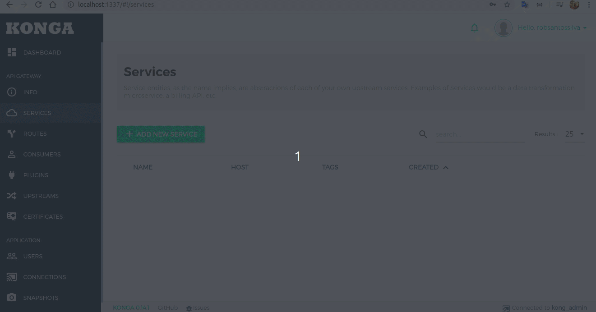

# Konga docker-compose
 Docker-compose file to start Kong

```bash
 sudo docker-compose up -d
```

### Kong
```bash
localhost:8000 //Kong’s admin API
localhost:8000 //Gateway
```

### Konga
```bash
localhost:1337 //Konga Dashboard
```

### Example for create a new service and route


https://medium.com/@tselentispanagis/managing-microservices-and-apis-with-kong-and-konga-7d14568bb59d


